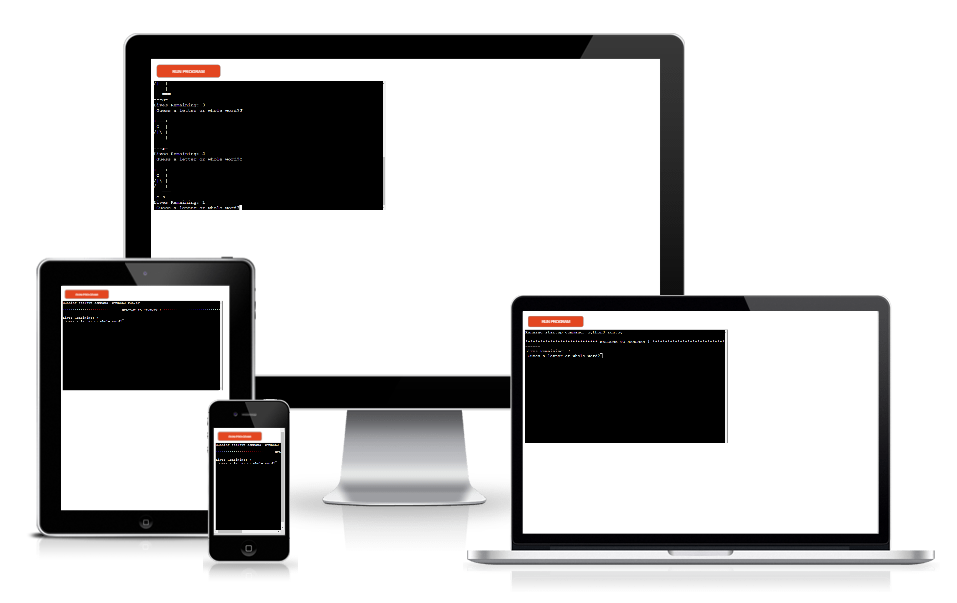
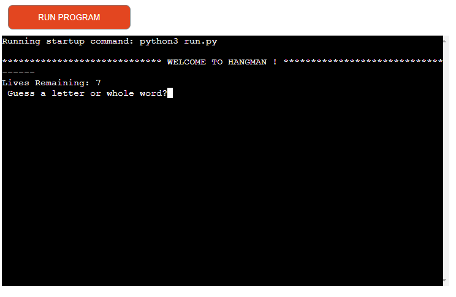
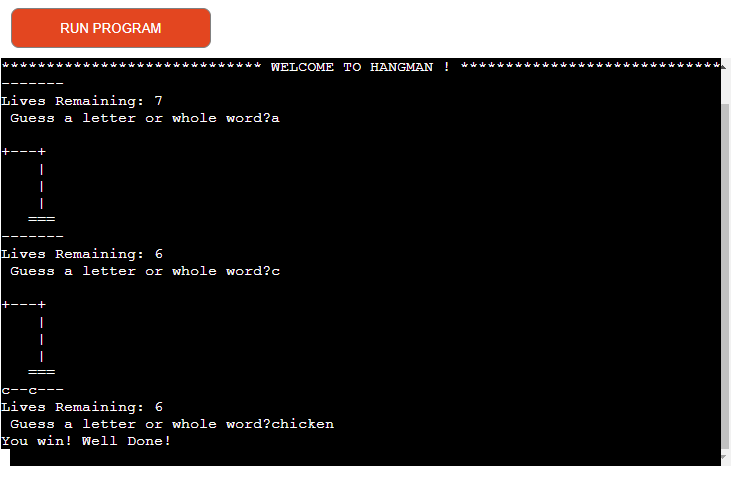
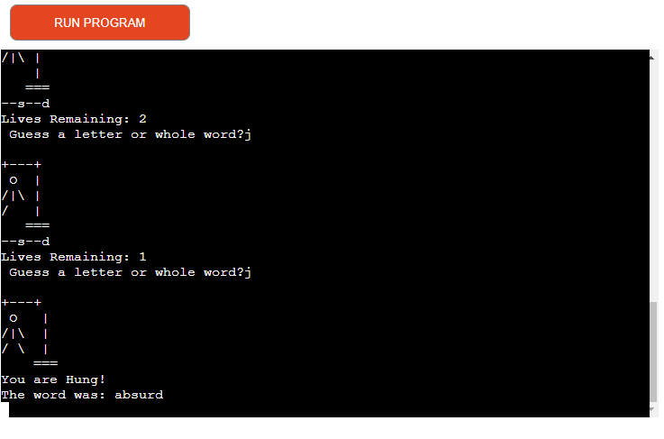
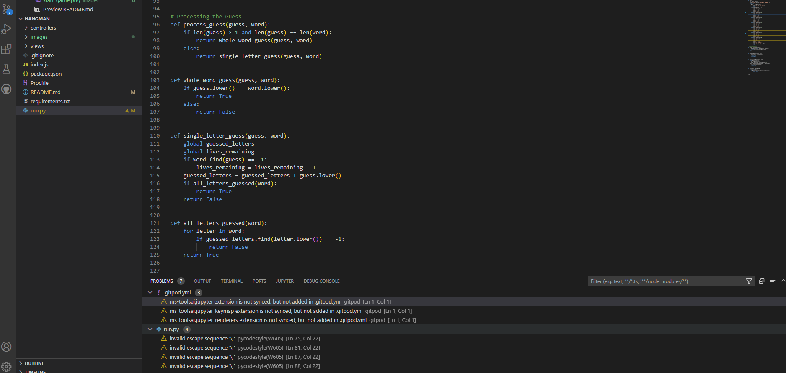

# **Hangman65**
A classic Hangman game written in Python and played on a Code Institute mock terminal on Heroku.
Users can try to guess the word by inputting letters until they either guess the word or it is game over. 
 

[Hangman65](https://hangman65.herokuapp.com/) - You can view the live site here. 

 

## **Table of Contents**
 * [**How to Play**](#how-to-play)
 * [**User Experience**](#user-experience)
 * [**Features**](#features)
 * [**Testing**](#testing)
 * [**Technologies Used**](#technologies-used)
 * [**Deployment**](#deployment)
 * [**Credits**](#credits)
 

## **How to Play**
The aim of the game is to guess the hidden word, represented with _ _ _ _ to show players how many letters are in the word. As the player corrrectly guesses letters, the _ are replaced with the correct letter. If a player puts in an incorrect command, an error message displays and the player is asked to resubmit their choice. 
The game is over either when the player has correctly guessed the word or they have run out of lives. 

## **User Experience**

The purpose of the game is a simple word game for entertainment purposes in a termminal environment using Python.

The site is designed with user experience in mind:

 * User wants to enjoy playing word game.
 * User wants to win the game and get winning message when it is achieved
 * User wants to have clear feedback for their action
 * Provides clear error messages to help the user input the correct values expected

 ## **Features**

 ### **Existing Features**

This is the main section of the game, where is picks a random word fromand display the length of the word with underscores. It will display how many lives are left. 
It the then displays a winner or loser message depending on the outcome.

- __The win section__

  - This section displays the winner's message.

  

  __The lose section__

  - This section displays a loser message.

## **Future Features**
 * Add a scoring system.
 * Implement a true random word generator rather than using a set list. 
 

## **Testing**
I have manually tested the project by doing the following: 
* Tested the code in the Code Institute Heroku terminal and also the terminal inside of Gitpod. 
* No errors showing on gitpod terminal after installing pycodestyle due to PEP8 website being down.

## **Technologies Used**
* Languages
  * Python.
* Libraries
  * random to select a random word.

## **Deployment**
The project was deployed using Code Institutes mock terminal for Heroku. Steps to deploy:

- Go to the Heroku Dashboard.
- Click New.
- Select to create a new app.
- Add Config Var's for Creds and Port
- Set the buildbacks to Python and NodeJS in that order.
- Link the Heroku app to the repository.
- Click on Deploy.

## **Credits**
 * Code institute for the sample READ.md for layout.
 * W3 school online
 * Fellow coders in stackoverview
 * Youtube videos

